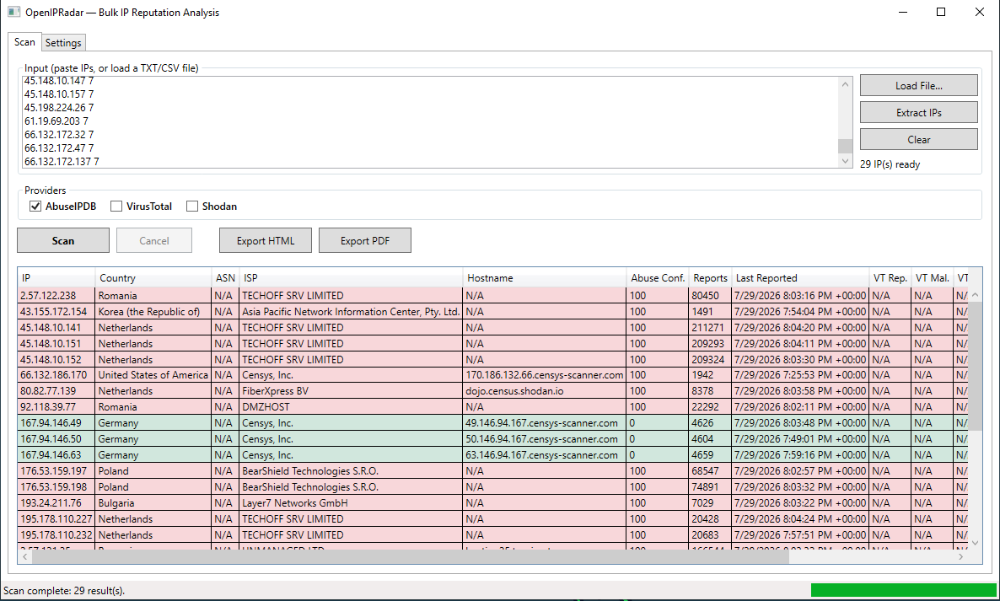

# OpenIPRadar

A Windows desktop application for bulk IP reputation analysis. Paste a list of IPs or load a file, select your threat intelligence providers, and get a colour-coded risk report in seconds — with one-click export to HTML or PDF.

## Features

- **Bulk input** — paste IPs directly, or load a `.txt` or `.csv` file
- **IPv4 and IPv6** support with automatic extraction and deduplication
- **Three threat intelligence providers** — AbuseIPDB, VirusTotal, Shodan
- **15-column results table** — IP, Country, ASN, ISP, Hostname, Abuse Confidence, Reports, Last Reported, VT Reputation, VT Malicious, VT Suspicious, Open Ports, Operating System, Tags, Threat Score
- **Colour-coded risk levels** — Malicious (red), Suspicious (yellow), Clean (green)
- **Export** to HTML (self-contained) or PDF (A4 landscape via QuestPDF)
- **Secure key storage** — API keys are encrypted with Windows DPAPI and never written in plaintext
- **Rate limiting** — per-provider request throttling (respects VirusTotal's 4 req/min free tier)
- **Cancellable scans** with live progress bar
- **Async throughout** — the UI thread is never blocked

## Screenshots



## Requirements

- Windows 10 or later (x64)
- [.NET 10 Desktop Runtime](https://dotnet.microsoft.com/download/dotnet/10.0) (or SDK if building from source)
- API keys for any providers you want to use (each is optional individually)

## Getting Started

### Build from source

```
git clone https://github.com/shreethaar/OpenIPRadar.git
cd OpenIPRadar/OpenIPRadar
dotnet restore
dotnet run
```

### Publish a standalone executable

```
dotnet publish -c Release -r win-x64 --self-contained
```

The `.exe` and all dependencies land in `bin\Release\net10.0-windows\win-x64\publish\`.

## API Keys

Go to the **Settings** tab after launching. Paste your key for each provider and click **Save** — the key is immediately encrypted with DPAPI and stored in `%AppData%\OpenIPRadar\keys.dat`. Keys are never written to disk in plaintext and never appear in logs.

| Provider | Where to get a key | Free tier |
|---|---|---|
| AbuseIPDB | [abuseipdb.com/api](https://www.abuseipdb.com/api) | 1 000 checks/day |
| VirusTotal | [virustotal.com/gui/join-us](https://www.virustotal.com/gui/join-us) | 4 requests/min |
| Shodan | [account.shodan.io](https://account.shodan.io/) | Limited (query credits) |

You only need keys for the providers you want to use. Providers without a key are automatically excluded from scans.

## Usage

1. **Paste IPs** into the input box, or click **Load File** to open a `.txt` or `.csv`
2. Click **Extract IPs** — duplicates are removed and the count is shown
3. Select which providers to query using the checkboxes (only configured providers are selectable)
4. Click **Scan** — results appear in the table as each IP completes
5. Click **Export HTML** or **Export PDF** to save the report

## How the Threat Score Works

The score (0–100) is the strongest signal across providers:

- **AbuseIPDB** — abuse confidence score used directly
- **VirusTotal** — `malicious × 12 + suspicious × 4`, clamped to 100

| Score | Risk Level |
|---|---|
| ≥ 70 | Malicious |
| ≥ 30 | Suspicious |
| < 30 | Clean |
| No data | Unknown |

## Project Structure

```
OpenIPRadar/
├── Core/
│   ├── Abstractions/       12 interfaces (IThreatProvider, IScanOrchestrator, …)
│   ├── Configuration/      AppSettings model
│   ├── Enums/              IpVersion, RiskLevel, ProviderResultStatus, ReportFormat
│   ├── Exceptions/         ProviderException, RateLimitExceededException, ApiAuthenticationException
│   └── Models/             IpAddressEntry, ProviderResult, ThreatReport, ScanReportModel, …
├── Services/
│   ├── Configuration/      ConfigurationService (appsettings.json + user overrides)
│   ├── Http/               SharedHttpClient, RetryPolicy
│   ├── Input/              IpExtractor (GeneratedRegex + IPAddress.TryParse), InputFileReader
│   ├── Logging/            FileAppLogger (Channel-backed async writer, daily rotation)
│   ├── RateLimiting/       TokenBucketRateLimiter (per-provider SemaphoreSlim + interval)
│   ├── Reporting/          HtmlReportExporter, PdfReportExporter, ReportModelBuilder
│   ├── Scanning/           ScanOrchestrator (Parallel.ForEachAsync + Task.WhenAll), RiskAggregator
│   └── Security/           DpapiKeyStore (crypt32.dll P/Invoke — no NuGet)
├── Providers/
│   ├── ProviderBase.cs     Rate-limit + retry + error-mapping choke point
│   ├── AbuseIpDb/
│   ├── VirusTotal/
│   └── Shodan/
├── Presentation/
│   ├── Converters/         RiskLevelToBrushConverter, NullableToNaConverter
│   ├── Mvvm/               ObservableObject, RelayCommand, AsyncRelayCommand (hand-rolled)
│   ├── Services/           DialogService
│   └── ViewModels/         MainViewModel, SettingsViewModel, ProviderKeyViewModel, ProviderToggleViewModel
├── CompositionRoot.cs      Manual DI — wires the entire graph at startup
├── App.xaml / App.xaml.cs
├── MainWindow.xaml / .cs
└── appsettings.json        Provider endpoints, rate limits, scan settings, log directory
```

## Configuration

`appsettings.json` controls provider endpoints, concurrency, timeouts, and retry behaviour. You can override any value by creating `%AppData%\OpenIPRadar\settings.json` with only the keys you want to change — the overlay is merged at startup.

```json
{
  "Scanning": {
    "MaxConcurrency": 4,
    "HttpTimeoutSeconds": 30,
    "RetryCount": 3,
    "RetryBaseDelayMs": 500
  },
  "Providers": {
    "AbuseIPDB":  { "RequestsPerMinute": 60 },
    "VirusTotal": { "RequestsPerMinute": 4  },
    "Shodan":     { "RequestsPerMinute": 60 }
  }
}
```

## Logging

Logs are written asynchronously to `%AppData%\OpenIPRadar\logs\log-yyyyMMdd.txt`. Provider errors are logged at `Warning` or `Error` level. API keys are never included in log output.

## Design Decisions

- **Zero NuGet dependencies** except QuestPDF (PDF export only, isolated behind `IReportExporter`)
- **DPAPI via direct P/Invoke** — avoids the `System.Security.Cryptography.ProtectedData` NuGet package while keeping key storage secure
- **Single shared `HttpClient`** on `SocketsHttpHandler` with `PooledConnectionLifetime = 5 min` — avoids socket exhaustion and stale DNS
- **Hand-rolled MVVM and DI** — no third-party MVVM toolkit or IoC container
- **Provider isolation** — a failed provider returns a failed `ProviderResult`; it never throws to the orchestrator or crashes the scan

## Adding a Provider

1. Create a class in `Providers/YourProvider/` that extends `ProviderBase`
2. Implement `BuildCheckRequest`, `BuildConnectivityRequest`, and `ParseResponse`
3. Add the provider's settings to `appsettings.json`
4. Register it in `CompositionRoot.cs`
